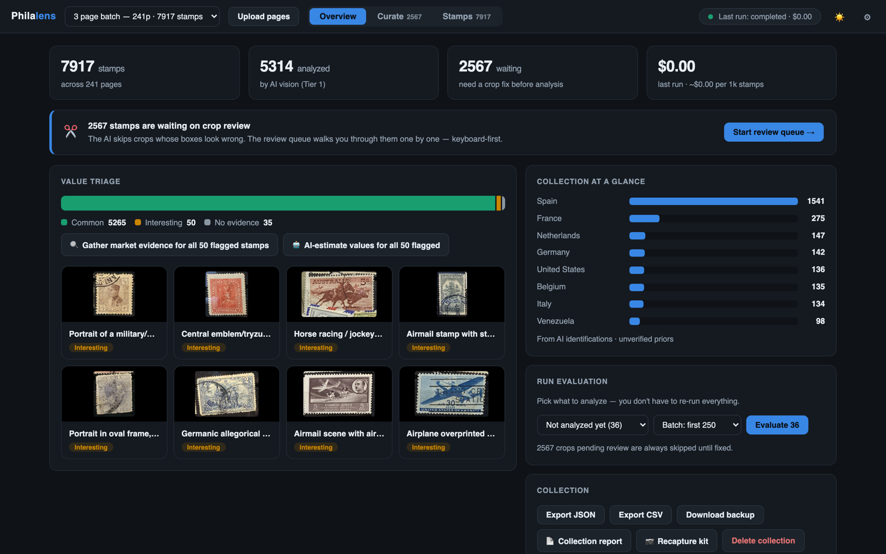
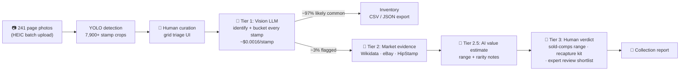
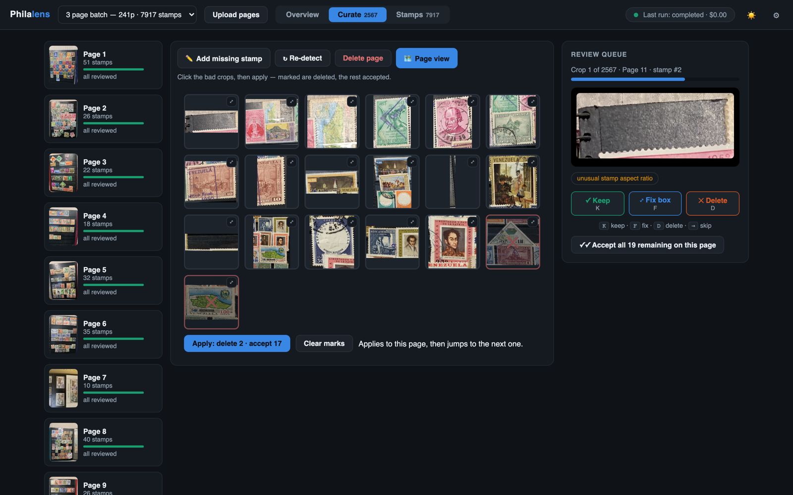
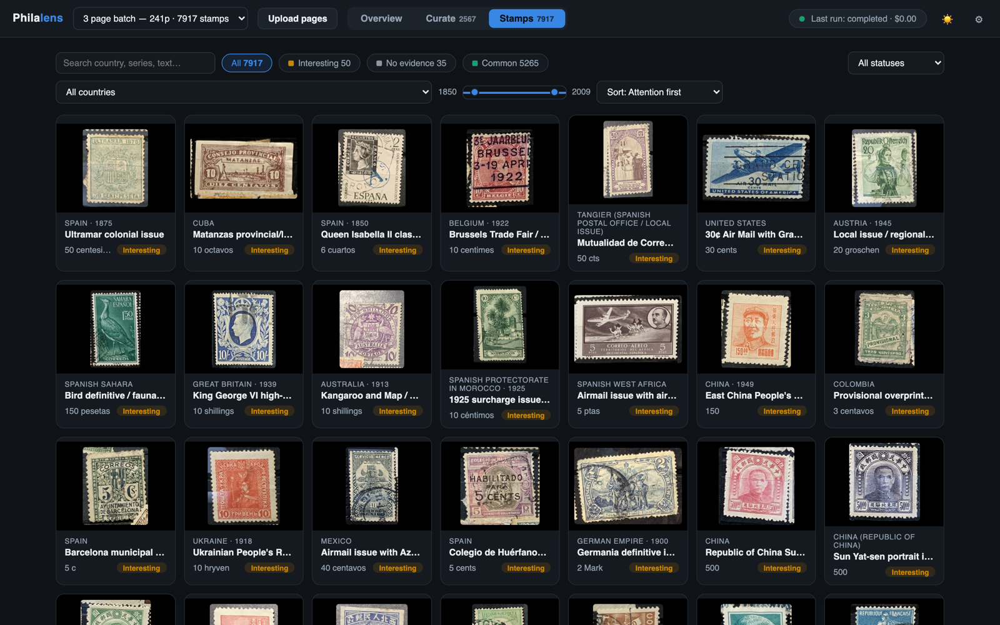
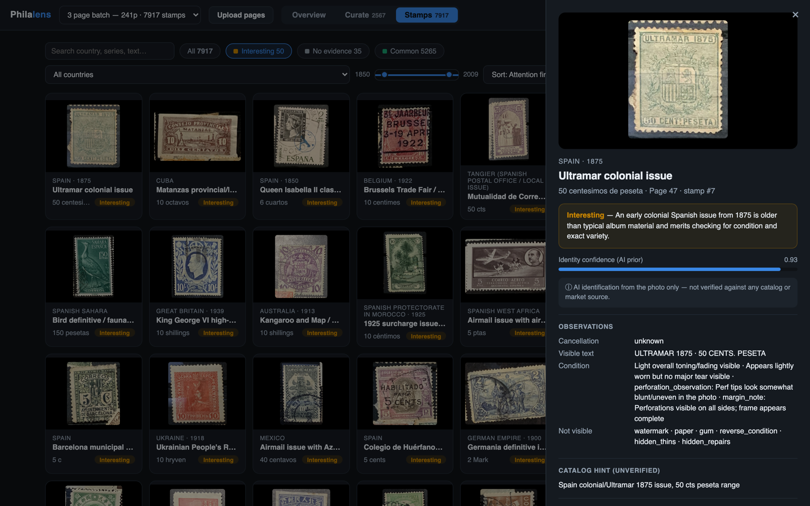
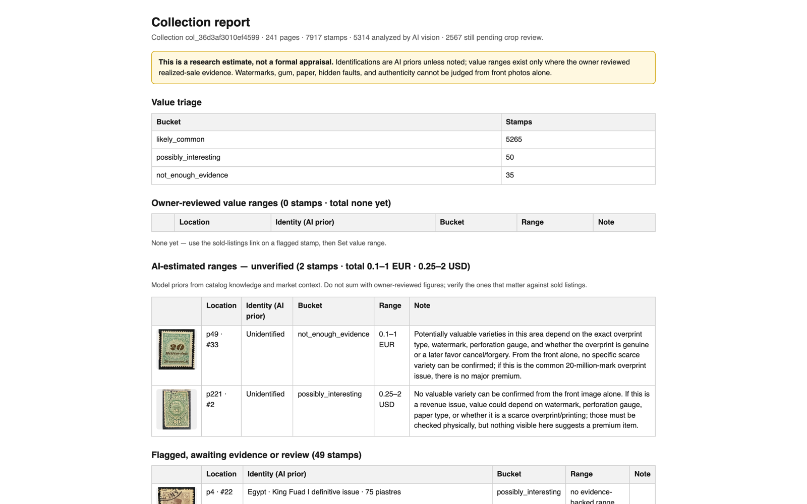
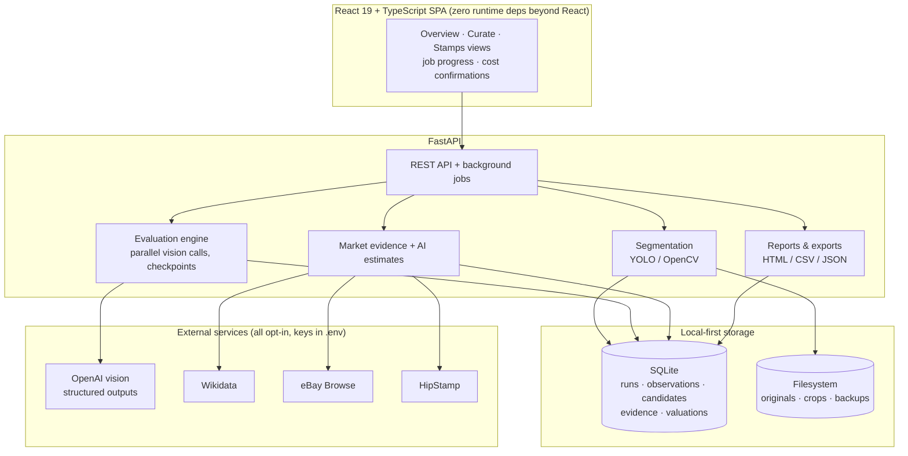

<div align="center">

# 🔍 Philalens

**Turn a shoebox of stamp album photos into an evidence-backed, AI-analyzed collection inventory.**

[](backend/pyproject.toml)
[](backend/src/philalens/api.py)
[](frontend/)
[](frontend/tsconfig.json)
[](backend/tests/)
[](LICENSE)



*Real numbers from the author's inherited collection: **241 album page photos → 7,900+ stamps** detected, identified, and value-triaged — for about **$12** in AI API calls.*

</div>

---

## The problem

You inherit stamp albums. Hundreds of pages, thousands of stamps, zero expertise. Are any of them valuable? A professional appraisal costs more than most collections are worth, and doing it yourself means months with a catalog.

Philalens is a **local-first web app** that automates the triage: photograph each album page, and it detects every stamp, identifies country/series/year with a vision LLM, cross-checks marketplaces, and tells you which handful of stamps actually deserve human attention — with every estimate carrying its evidence and its uncertainty.

## How it works — a three-tier funnel

The core design insight: **95%+ of any inherited collection is common material worth cents.** So spend fractions of a cent per stamp broadly, and escalate only the outliers.



Every stage is **checkpointed in SQLite**: runs are resumable after crashes or stops, nothing paid is ever re-billed, and a database snapshot is taken automatically after every run.

## Feature tour

### Curate thousands of crops in minutes, not days

The YOLO detector finds stamp regions on each page; a keyboard-first review queue (K keep / F fix / D delete) handles single crops, and **grid triage** clears a whole page at once — click the album-border false positives, one button deletes the marked and accepts the rest:

<div align="center">

</div>

### Every stamp identified, searchable, and explained

One structured vision call per stamp (near-duplicates share a call) extracts visible text, condition, and identity candidates with confidence — never inventing catalog numbers. The gallery filters by country, year range (slider), value bucket, and analysis status:

<div align="center">

</div>

The stamp card shows the full reasoning chain — identification with confidence, why it was bucketed, what the photo *cannot* show (watermark, gum, hidden repairs), marketplace evidence, AI value estimate with rarity notes, and a link to eBay **sold** listings for human verification:

<div align="center">

</div>

### Honest valuation, by design

Most "AI valuation" tools hallucinate a price. Philalens instead models **evidence strength explicitly** — a value range only exists when the evidence tier supports it:

| Evidence | Tier | Can set a range? |
|---|---|---|
| Wikidata reference metadata | `reference_metadata` | No — identity context only |
| eBay / HipStamp active listings | `active_listing_weak` | **Never** — asking prices skew high; shown as labeled context only |
| AI value estimate (model prior + market context) | unverified | Yes, but amber-labeled, capped confidence, never summed with verified figures |
| Realized sales | `realized_sale` | Yes (≥2 price points + identity confidence ≥ 0.5) |
| Owner-reviewed sold comparisons | human-verified | Yes — the gold tier |

The printable **collection report** keeps these tiers separate to the end, and the **recapture kit** generates per-stamp photo instructions (backlit watermark shot, perforation edge with a ruler…) derived from exactly what the AI couldn't observe:

<div align="center">

</div>

## Engineering highlights

- **Parallel vision pipeline** — sliding-window concurrency over the OpenAI Responses API with per-crop checkpointing, graceful stop (in-flight paid calls finish and save), resume-without-rebilling, and rate-limit backoff. 500 stamps analyzed in 14 minutes.
- **Cost engineering** — perceptual-hash duplicate grouping shares vision calls; pre-run cost estimates with a confirm dialog; scoped runs (*not analyzed / flagged / failed*) and batch sizes so nothing is ever paid twice; per-run actual cost recorded from token usage. A curated model dropdown shows $/100-stamps per model.
- **Performance at collection scale** — the review queue originally rebuilt a 6.3 MB export per keystroke (~32,000 SQLite round-trips). Batched queries + light endpoints + client-side state mirroring took collection loads from **4.96 s → 0.19 s** and queue actions to **19 ms**.
- **Durable, overlaid evaluation runs** — every run is a versioned record; each stamp always shows its newest results across runs, so scoped re-runs never hide earlier work. Automatic SQLite snapshots (online backup API) after every run.
- **Source adapter architecture** — Wikidata (keyless), eBay Browse (OAuth client-credentials), and HipStamp behind one protocol; keys live in `.env` only; adapters respect access rules (Colnect blocks bots — so Philalens doesn't go there).
- **81 backend tests** covering schema contracts, evidence-tier rules, cancellation/resume semantics, and the API surface.

## Architecture



**Stack**: Python 3.11 · FastAPI · SQLite · Pillow/pillow-heif (HEIC) · OpenCV · Ultralytics YOLO (optional) · OpenAI structured outputs · httpx — React 19 · TypeScript strict · Vite.

## Built with (and for) AI agents

This repo is also an experiment in **agent-maintainable software**. It was built through AI-agent pair-development sessions, structured so any future session can continue the work from the repo alone:

- [`AGENTS.md`](AGENTS.md) — the canonical operating guide any AI coding agent reads first
- [`docs/ai/context.md`](docs/ai/context.md) — durable project memory (decisions, constraints, state)
- [`docs/ai/session-handoff.md`](docs/ai/session-handoff.md) — a running handoff log, one entry per work session
- [`scripts/check_agent_context.py`](scripts/check_agent_context.py) + GitHub Actions — CI that **fails when code changes don't update the durable context**

The result: 20+ development sessions, each starting cold with no chat history, with product decisions, guardrails, and open questions preserved in files rather than heads.

## Getting started

```bash
git clone https://github.com/aprada9/philalens.git && cd philalens

# Backend
cd backend
python3 -m venv .venv && source .venv/bin/activate
pip install -e ".[dev]"
pytest                       # 81 tests

# Frontend
cd ../frontend
npm install && npm run build # served by FastAPI from frontend/dist

# Optional: the better stamp detector (Ultralytics YOLO, Apache-2.0 model)
cd ../backend && pip install -e ".[dev,yolo]"
cd .. && python3 scripts/download_stamp_detector.py

# Run
cd backend && uvicorn philalens.api:app --reload
# → http://127.0.0.1:8000
```

Copy [`.env.example`](.env.example) to `.env` for configuration. Everything runs locally with no external calls until you add an OpenAI key (Settings dialog or `.env`) and explicitly start an evaluation — with a cost estimate shown first. eBay and HipStamp keys are optional and activate their evidence sources automatically.

## Honest limitations

- A front photo cannot prove watermark, paper, gum, hidden repairs, or authenticity — the app says so per stamp instead of pretending otherwise.
- Identifications are AI priors with confidence scores, not catalog-verified facts.
- **Nothing here is a formal appraisal.** Philalens is a research and triage assistant; for stamps that matter, it points you to sold prices and experts — and gives you the shortlist.

## License

[MIT](LICENSE) © Álvaro de Prada Martínez
